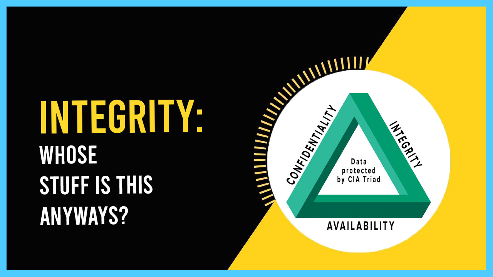
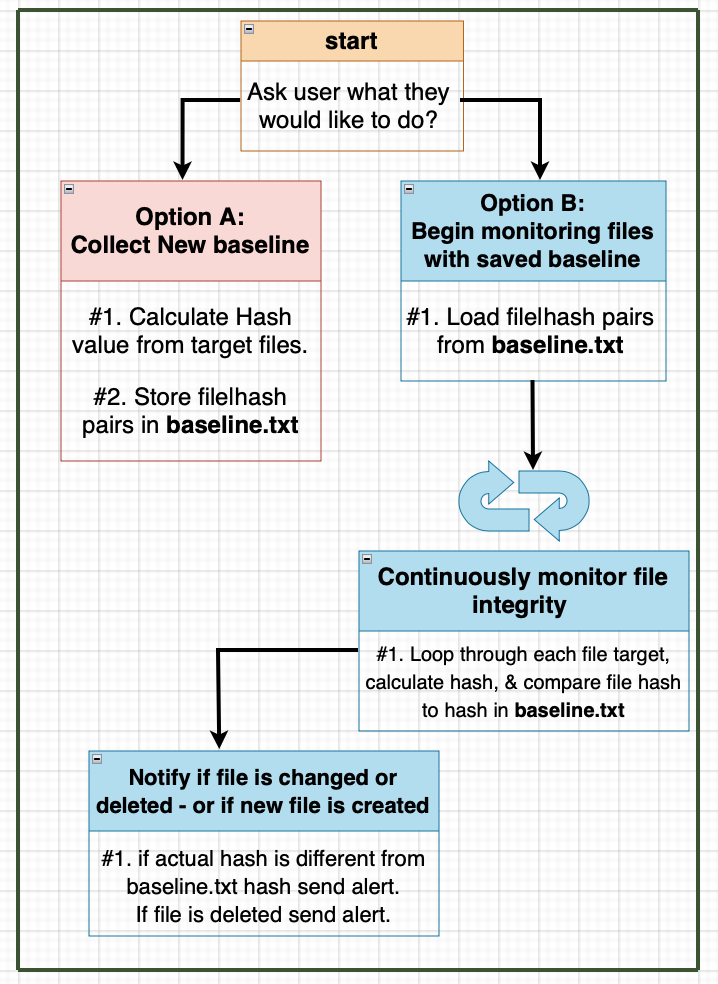

# CIA Triad - Integrity LIVE Demo (FIM software Project)

Today we have a LIVE demo of what integrity means in the world of cyber security. You can expect more Powershell scripts in the Windows environment and a real-time explanation of integrity: )

Don't forget to download the fim.ps1 file to try it out yourself!
> Shoutout [Josh](https://www.youtube.com/c/JoshMadakor) for the tutorial.

[CLICK HERE FOR THE LIVE DEMO](https://www.youtube.com/watch?v=VskiYuvMv5U)

Pictured below is a flow chart of a software FIM that continuously checks NOTHING changes in a specific file path! Keep an eye out for a video demo and watch INTEGRITY unfold in real-time.

